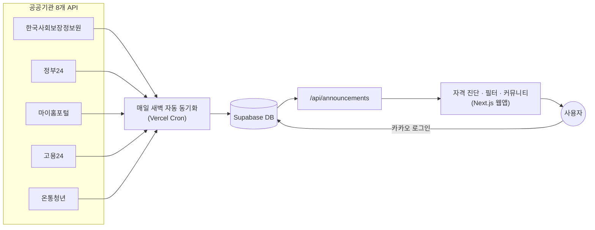

# 🧭 모자 (MOJA)

**"몰라서 못 받는 지원이 없도록."**

자립준비청년(보호종료아동)을 위한 정부 지원 매칭 서비스입니다. 8개 공공기관에 흩어져 있는
지원 공고를 한곳에 모아 조건에 맞는 것만 골라 보여주고, 카카오 로그인 한 번으로 내 상황에
맞춰 계속 개인화된 정보를 받아볼 수 있고, 같은 처지의 또래와 이야기 나눌 수 있는 익명
커뮤니티도 제공합니다.

🔗 **배포 사이트**: [moja-khaki.vercel.app](https://moja-khaki.vercel.app)
👥 **팀**: 파란만 (AX-Ton 해커톤)

---

## 💡 왜 만들었나

자립준비청년은 만 18세 전후로 보호시설·위탁가정을 떠나 홀로서기를 시작합니다. 자립수당,
자립정착금, 주거 지원, 대학등록금 지원처럼 받을 수 있는 지원이 분명히 있는데도, 이 정보가
보건복지부·정부24·지자체·고용24·온통청년 등 8개가 넘는 기관 사이트에 뿔뿔이 흩어져 있어서
정작 당사자가 "내가 뭘 받을 수 있는지" 스스로 알아내기가 매우 어렵습니다.

**모자는 이 정보 격차를 없애는 걸 목표로 합니다.** 몇 가지 질문에 답하면 지금 내 상황
(생년월일, 보호종료 유형·시기, 거주 지역, 재학 여부, 소득 조건 등)에 맞는 지원만 걸러서
보여주고, 왜 안 되는지도 이유와 함께 알려줍니다.

## ✨ 핵심 기능

### 🔍 자격 정밀 진단
12개 질문에 답하면 8개 공공 API에서 모아온 공고를 자동으로 매칭해서 **가능성 높은 지원 /
확인이 필요한 지원 / 지금은 해당하지 않는 지원**으로 나눠 보여줍니다. 안 되는 이유도
"거주 지역이 달라요", "재학 중이어야 해요"처럼 명확하게 설명합니다.

- **보호종료일 자동 계산**: "만 18세에 종료"를 고르면 생년월일 기준으로 정확한 종료일을
  자동 계산합니다 (「아동복지법」 제38조 근거). 보호종료 후 경과 기간, 5년 지원 기한까지
  D-day로 바로 보여줍니다.
- **데이터 필터 5종**: 매칭 결과 / 전체 공고 보기 / 지역별 보기 / 현재상태별 보기 /
  관심분야로 보기 — 자격 판정과 별개로 원하는 기준으로 공고를 직접 훑어볼 수 있습니다.
- **#태그**: 법조문투 공고 설명에서 "가정위탁", "보호종료", "무주택" 같은 핵심 키워드를
  뽑아 한눈에 훑어볼 수 있게 표시합니다.

### 🔑 카카오 로그인 + 개인화
로그인하면 진단 결과가 계정에 저장돼서, 다음에 방문할 땐 랜딩 화면이 바로 **내 자립 현황
요약**(지역·현재상태·관심분야, 보호종료까지 남은 기간)으로 바뀝니다. 매번 12개 질문에
다시 답할 필요가 없습니다.

- ⭐ **관심공고 저장**: 마음에 드는 공고를 별표로 저장하고 모아볼 수 있습니다.
- 🔄 **매일 자동 갱신**: 새벽마다 8개 공공 API를 다시 확인해서 새 공고는 추가하고, 마감된
  공고는 자동으로 화면에서 숨깁니다.

### 💬 커뮤니티
로그인 없이도 익명 닉네임으로 글을 쓰고 볼 수 있습니다. 로그인하면 "익명으로 쓰기"와
"내 닉네임으로 쓰기" 중 골라 쓸 수 있고, 본인이 쓴 글·댓글은 나중에 찾아서 수정·삭제할 수
있습니다.

## 🛠 기술 스택

| 영역 | 기술 |
|---|---|
| 프레임워크 | Next.js 15 (App Router), React 19, TypeScript |
| 데이터베이스 | Supabase (PostgreSQL, Row Level Security) |
| 인증 | Supabase Auth + 카카오 로그인(OAuth) |
| 배포 | Vercel (+ Vercel Cron으로 매일 자동 동기화) |
| 외부 데이터 | 한국사회보장정보원, 정부24, 마이홈포털, 고용24, 온통청년 — 8개 공공 API |

## 🏗 데이터 흐름



방문할 때마다 공공 API를 직접 호출하지 않고, DB에 미리 모아둔 데이터만 읽기 때문에
API 호출 한도 문제 없이 빠르게 응답합니다.

## 🚀 시작하기

```bash
npm install
```

`.env.local.example`을 참고해서 `.env.local`을 직접 만드세요 (공공데이터 API 키, Supabase 키
등 — git에 커밋되지 않으니 팀원마다 각자 준비해야 합니다). 카카오 로그인 키는 코드가 아니라
Supabase 대시보드(Authentication → Providers)에 등록되어 있습니다.

```bash
npm run dev
```

http://localhost:3000 에서 확인합니다.

## 📁 폴더 구성

```
app/
  api/            # 공공데이터 API 조회·동기화, 커뮤니티 CRUD 라우트
  data/           # 온보딩 질문/자격 매칭 로직, 공고 텍스트 분류
  hooks/          # 로그인 세션 훅
  components/     # 온보딩 위저드 + 결과 화면 UI (5개 필터 탭 포함)
  community/      # 커뮤니티 화면 (목록/글쓰기/상세/내 활동)
lib/
  govApis.ts      # 8개 공공 API 공용 fetch/파싱
  supabase.ts     # Supabase 클라이언트
  bookmarks.ts    # 관심공고·클릭로그
  communityClient.ts / communityDb.ts   # 커뮤니티 CRUD (로그인/비로그인)
supabase/
  schema.sql      # DB 스키마 전체
vercel.json       # 매일 자동 동기화 크론 설정
docs/
  handoff-*.md    # 진행 상황 인계 문서 — 새로 합류했다면 가장 최근 파일부터 읽기
  announcement-review-guide.md  # 공고 데이터 검수 가이드
```

## 🌿 브랜치

- `main`: 지금 이 브랜치 — 소개·배포 기준
- `dev`: 실제 작업 브랜치
- `release/*`: 배포할 때마다 그 시점 커밋을 가리키는 스냅샷 브랜치

## 📚 더 자세한 내용

지금까지의 진행 상황, 의도적으로 보류한 기능, 다음 할 일은 `dev` 브랜치의
[docs/handoff-2026-08-25.md](https://github.com/KIMGA000/moja/blob/dev/docs/handoff-2026-08-25.md)에
정리되어 있습니다 (가장 최신 인계 문서 — `main`에는 없고 `dev`에만 있어요).

---

<p align="center">자립준비청년 여러분이 놓치는 지원이 없기를 바라며. — 파란만 팀</p>
